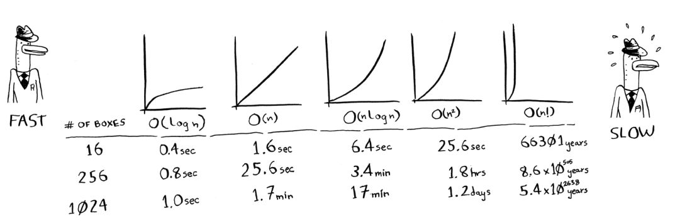

# Binary Search

 Suppose you’re searching for a person in the phone book (what an old-fashioned sentence!). Their name starts with K. You could start at the beginning and keep flipping pages until you get to the Ks. But you’re more likely to start at a page in the middle, because you know the Ks are going to be near the middle of the phone book.

`This is a search problem. And all these cases use the same algorithm to solve the problem: binary search.`

## Binary Search Input

- A sorted list of elements
- The element you are looking for

## Binary Search Output

`If an element you’re looking for is in that list, binary search returns the position where it’s located. Otherwise, binary search returns null`

## Example

Here’s an example of how binary search works. I’m thinking of a
number between 1 and 100.

- First, I guess 50. Too high. So now I know the number is between 1 and 50.
- Then I guess 25.
- Too low. So now I know the number is between 25 and 50.
- Then I guess 37.
- Too high. Now I know the number is between 25 and 37.
- Then I guess 31.
- Too low. Now I know the number is between 31 and 37.
- Then I guess 34.
- Too high. Now I know the number is between 31 and 34.
- Then I guess 32.
- I got it!

`This is binary search in action. It’s a way of finding the right number by halving the search space each time.`

How many steps did it take to find the number? It took me at most seven steps. That’s because I started with a list of 100 numbers. And 2^7 is approximately 100.

For a simple search problem like this, binary search is a huge time-saver. It’s much faster than searching through all the numbers one by one.

- `Binary search runs in logarithmic time O(log n) in the worst case.`
- `Linear search runs in linear time O(n) in the worst case.`

## Binary Search Pseudocode

Here’s a simple version of binary search in pseudocode:

```cpp
int binary_search(std::vector<int> &arr, int target){
    int low = 0;
    int high = arr.size() - 1;
    while (low <= high){
        int mid = low + (high - low) / 2;
        if (arr[mid] == target) return mid;
        else if (arr[mid] < target) low = mid + 1;
        else high = mid - 1;
    }
    return -1;
}
```

## Exercises

- 1.1 Suppose you have a sorted list of 128 names, and you’re searching through it using binary search. What’s the maximum number of steps it would take?

- `The maximum number of steps is 7. This is because 2^7 is 128.`

- 1.2 Suppose you double the size of the list. What’s the maximum number of steps now?

- `The maximum number of steps is 8. This is because 2^8 is 256.`

# Runing Time

Any time I talk about an algorithm, I’ll discuss its running time.
Generally you want to choose the most efficient algorithm—
whether you’re trying to optimize for time or space.
Back to binary search. How much time do you save by using
it? Well, the first approach was to check each number, one by
one. If this is a list of 100 numbers, it takes up to 100 guesses.
If it’s a list of 4 billion numbers, it takes up to 4 billion guesses. So the
maximum number of guesses is the same as the size of the list. This is
called linear time.
Binary search is different. If the list is 100 items long, it takes at most
7 guesses. If the list is 4 billion items, it takes at most 32 guesses.
Powerful, eh? Binary search runs in logarithmic time (or log time, as
the natives call it). Here’s a table summarizing our findings today.

## Big O Notation

Big O notation is special notation that tells you how fast an algorithm is.
Who cares? Well, it turns out that you’ll use other people’s algorithms
often—and when you do, it’s nice to understand how fast or slow they
are.

### Algorithm running times grow at different rates

 Bob is writing a search algorithm for NASA. His algorithm will kick in
when a rocket is about to land on the Moon, and it will help calculate
where to land.
This is an example of how the run time of two algorithms can grow
at different rates. Bob is trying to decide between simple search and
binary search. The algorithm needs to be both fast and correct. On one
hand, binary search is faster. And Bob has only 10 seconds to figure out
where to land—otherwise, the rocket will be off course. On the other
hand, simple search is easier to write, and there is less chance of bugs
being introduced. And Bob really doesn’t want bugs in the code to land
a rocket! To be extra careful, Bob decides to time both algorithms with
a list of 100 elements.
Let’s assume it takes 1 millisecond to check one element. With simple
search, Bob has to check 100 elements, so the search takes 100 ms to
run. On the other hand, he only has to check 7 elements with binary
search (log2 100 is roughly 7), so that search takes 7 ms to run. But
realistically, the list will have more like a billion elements. If it does,
how long will simple search take? How long will binary search take?
Make sure you have an answer for each question before reading on.

Bob runs binary search with 1 billion elements, and it takes 30 ms
(log2 1,000,000,000 is roughly 30). “32 ms!” he thinks. “Binary search
is about 15 times faster than simple search, because simple search took
100 ms with 100 elements, and binary search took 7 ms. So simple
search will take 30 × 15 = 450 ms, right? Way under my threshold of
10 seconds.” Bob decides to go with simple search. Is that the right
choice?

No. Turns out, Bob is wrong. Dead wrong. The run time for simple
search with 1 billion items will be 1 billion ms, which is 11 days! The
problem is, the run times for binary search and simple search don’t
grow at the same rate.

`That is, as the number of items increases, binary search takes a little
more time to run. But simple search takes a lot more time to run. So
as the list of numbers gets bigger, binary search suddenly becomes a
lot faster than simple search`

### `Big O notation Tells You How Fast an Algorithm is Relative to the size of operations.

- `O(log n) is faster than O(n), but it gets a lot faster as the list of items grows.`

### Big O Establishes a Worst-Case Run Time

Suppose you’re using simple search to look for a person in the phone
book. You know that simple search takes O(n) time to run, which
means in the worst case, you’ll have to look through every single entry
in your phone book. In this case, you’re looking for Adit. This guy is
the first entry in your phone book. So you didn’t have to look at every
entry—you found it on the first try. Did this algorithm take O(n) time?
Or did it take O(1) time because you found the person on the first try?

Simple search still takes O(n) time. In this case, you found what you
were looking for instantly. That’s the best-case scenario. But Big O
notation is about the worst-case scenario. So you can say that, in the
worst case, you’ll have to look at every entry in the phone book once.
That’s O(n) time. It’s a reassurance—you know that simple search will
never be slower than O(n) time.

`Along with the worst-case run time, it’s also important to look at the
average-case run time. Worst case versus average case is discussed in
chapter 4.`

### Some Common Big O Runtimes

- O(log n), also known as log time. Example: Binary search.
- O(n), also known as linear time. Example: Simple search.
- O(n * log n). Example: A fast sorting algorithm, like quicksort (coming up in chapter 4).
- O(n^2). Example: A slow sorting algorithm, like selection sort (coming up in chapter 2).
- O(n!). Example: A really slow algorithm, like the traveling salesperson (coming up in chapter 8).

### `Suppose you're drawing a grid of (n) boxes, and you can choose from 5 different algorithms to do so, You Can Do 10 Operations Per Second.`



## Summary For Big O Till We Meet Again in Chapter 4

- Algorithm speed isn’t measured in seconds, but in growth of the
number of operations.

- Instead, we talk about how quickly the run time of an algorithm
increases as the size of the input increases.

- Run time of algorithms is expressed in Big O notation.
- Instead, we talk about how quickly the run time of an algorithm
increases as the size of the input increases.

## Exercises

### Give the run time for each of these scenarios in terms of Big O.

- 1. You have a name, and you want to find the person’s phone number in the phone book.

`O(log n) (binary search)`

- 2. You have a phone number, and you want to find the person’s name in the phone book.
`O(n) (simple search)`

- 3. You want to read the numbers of every person in the phone book.
`O(n)`
- 4. You want to read the numbers of just the As. 
`O(n)`
