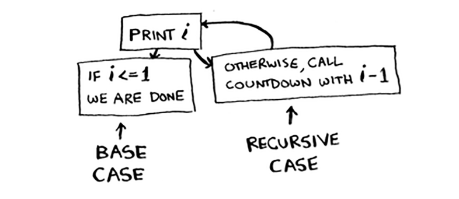

# Recursion

Suppose you’re digging through your grandma’s attic and come across a
mysterious locked suitcase.

Grandma tells you that the key for the suitcase is probably in this
other box.

This box contains more boxes, with more boxes inside those boxes. The
key is in a box somewhere. What’s your algorithm to search for the key?
Think of an algorithm before you read on.

## Here’s one approach

 1. Make a pile of boxes to look through.

 2. Grab a box, and look through it.
 3. If you find a box, add it to the pile to look through later.
 4. If you find a key, you’re done!
 5. Repeat.

## Here’s an alternate approach

1. Look through the box.
2. If you find a box, go to step 1.
3. If you find a key, you’re done!

Which approach seems easier to you? The first approach uses a while
loop. While the pile isn’t empty, grab a box and look through it:

`The second way uses recursion. Recursion is where a function calls itself.`

Both approaches accomplish the same thing, but the second approach
is clearer to me. Recursion is used when it makes the solution clearer.
There’s no performance benefit to using recursion; in fact, loops are
sometimes better for performance. I like this quote by Leigh Caldwell
on Stack Overflow: “Loops may achieve a performance gain for
your program. Recursion may achieve a performance gain for your
programmer. Choose which is more important in your situation!”1
Many important algorithms use recursion, so it’s important to
understand the concept.

## Base case and recursive case

Because a recursive function calls itself, it’s easy to write a
function incorrectly that ends up in an infinite loop

When you write a recursive function, you have to tell it when to stop
recursing. That’s why every recursive function has two parts: the base
case, and the recursive case. The recursive case is when the function calls
itself. The base case is when the function doesn’t call itself again … so it
doesn’t go into an infinite loop.

Here’s a simple example of a recursive function that counts down to
zero:

```cpp

void countDown(int i){
    std::cout<<i<<std::endl
    if(i<=0){
        return ;
    }else{
        countDown(i-1);
    }
}
```
Now the function works as expected. It goes something like this.



## The Stack

When you call a function from another function, the calling function is
paused in a partially completed state. All the variables of the function
are still in memory. This is because the computer needs to remember
where to return control when the function call returns. The place where
the computer stores this information is called the call stack.

When a function calls itself, the function’s variables are still stored in
memory. The computer uses the call stack to keep track of all the
functions that are running. The call stack is a stack data structure.

Here’s what happens when `countDown(3)` is called:

1. `countDown(3)` is called.
2. `countDown(3)` calls `countDown(2)`.
3. `countDown(2)` calls `countDown(1)`.
4. `countDown(1)` calls `countDown(0)`.
5. `countDown(0)` returns.
6. `countDown(1)` returns.
7. `countDown(2)` returns.
8. `countDown(3)` returns.

The call stack keeps track of the state of each function. When a function
returns, it knows where to return to. The call stack can get very large,
which takes up a lot of memory. If you run out of memory on the call
stack, you get a stack overflow error.


## Recap

- Recursion is when a function calls itself.
- Every recursive function has two cases: the base case and the recursive case.
- A stack has two operations: push and pop.
- All function calls go onto the call stack.
- The call stack can get very large, which takes up a lot of memory.
