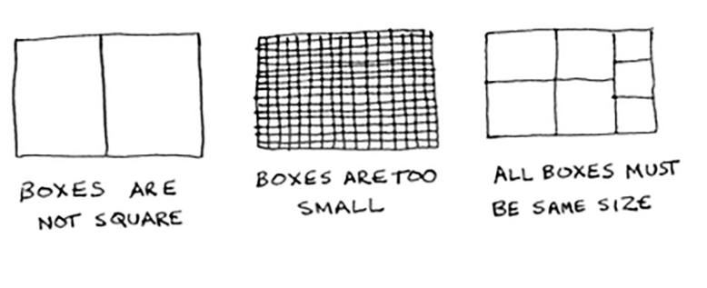

# Divide & Conquer

Divide and Conquer is a technique to solve problems by dividing them into smaller sub-problems. It is a recursive approach to solve problems. It is a top-down approach. It is a very powerful technique. It is used to solve many problems. It is used to solve problems like sorting, searching, matrix multiplication, etc.

## Examples to understand Divide & Conquer

### Suppose you’re a farmer with a plot of land.

You want to divide this farm evenly into square plots. You want the plots 
to be as big as possible. So none of these will work.

How to figure out the largest square plot you can make?

### Steps

1. Figure out the base case.
2. Divide until you reach the base case.

